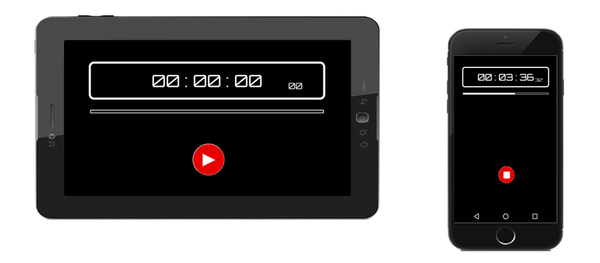

# Stopwatch created with JavaScript

Do you need to time a race or manage the time you perform your daily tasks? Use this timer on your phone, tablet or computer.
**More information below:**



# How to use it ?

- Press the button ```►``` to start the timer.
- To pause the timer, tap the display.
- Press the button ```∎``` or double-click the display to stop the timer.


# Browser Support:

The application has been tested on the following browsers:

|  Latest  | Latest   | Latest   |
| -------- | -------- | -------- |
|  Chrome  | Firefox  | Opera    |
 |  |  |
